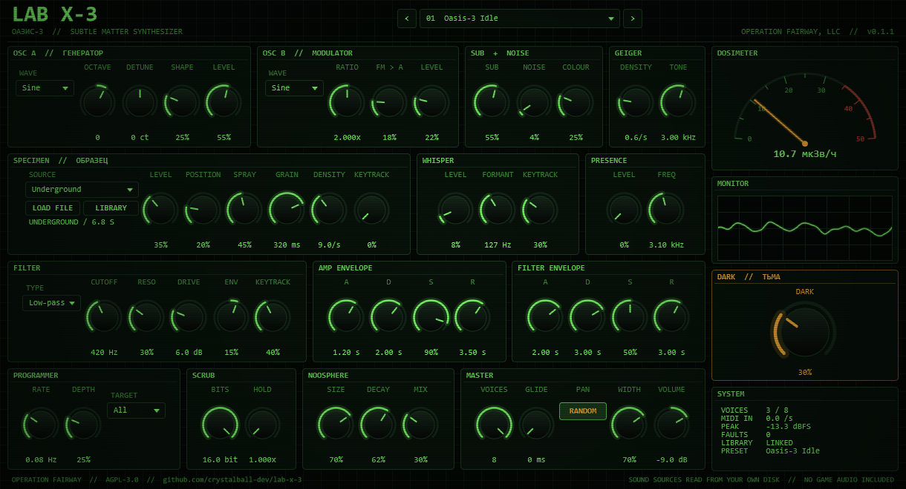

# LAB X-3

A dark, unstable synthesizer for Windows, built as a VST® 3 instrument and a standalone app. It is inspired by Lab X-3, the "Oasis-3" hallucinogenics facility from the S.T.A.L.K.E.R. games, and is made by OPERATION FAIRWAY as a personal proof of concept.

LAB X-3 is a fan project. It is not affiliated with or endorsed by GSC Game World, and this repository contains no game audio.



## What it does

- **Two oscillators.** OSC A offers a saw with a detuned partner, a pulse, a wavefolded sine, and "Subtle", a feedback-FM sine. OSC B can be heard on its own or phase-modulate OSC A for inharmonic clusters.
- **Sub, noise and Geiger.** A sub-octave sine, colour-variable noise, and a Poisson click generator tuned like a dosimeter.
- **SPECIMEN.** A granular engine that streams sound files from your own disk: the `stalker sounds` pack that ships with older FL Studio installs, and a STALKER SPECIMENS library extracted from your own copies of the games (see [Sound sources](#sound-sources)). Grain size, density, spray, position, keytracking and tuning turn a recording into playable, unrecognisable texture.
- **WHISPER and PRESENCE.** Noise through three formant resonances at 1:2:3, modelled on the psy-voice recordings, and a high, wavering whine modelled on the controller.
- **Filter and envelopes.** A driven state-variable filter with low-, band- and high-pass modes, plus amp and filter envelopes.
- **PROGRAMMER.** A slow, irregular random walk that keeps rewriting pitch, filter, formant or grain position.
- **SCRUB, NOOSPHERE and DARK.** Bit and sample-rate reduction, an 8-line feedback-delay reverb, and a DARK macro that pushes everything toward instability. The mod wheel adds to DARK.
- **Panning.** Each note lands at a random position across the stereo field; WIDTH sets how far, and the PAN switch in MASTER turns it off so every note sits in the centre.
- **20 factory presets**, named after the lore; the last eight are built on the STALKER SPECIMENS library. Switching presets fades out, clears the reverb and starts the new sound from silence, so an old tail is never stretched into the new room.
- **SYSTEM readout.** Active voices, incoming MIDI events per second, peak level and a fault counter. If notes sound while nothing should be playing, MIDI IN shows whether a controller is sending them.
- **Runaway guard.** A non-finite sample, or any stage above +48 dBFS, silences the block and restarts every stage; FAULTS counts it. Each fault, and any tail that climbs 12 dB over its level once the keys are up, is written with the parameters at the time to `%APPDATA%\OPERATION FAIRWAY, LLC\LAB X-3 faults.log`.

## Sound sources

The SPECIMEN layer reads audio from folders on your machine. Neither this repository nor its builds include any game audio: `Source/SpecimenCatalog.h` lists relative file paths only. The SOURCE menu has one sub-menu per library:

- **FL STUDIO PACK**: 18 sounds from the legacy `stalker sounds` pack inside an FL Studio install (`Data/Patches/Packs/Legacy/stalker sounds`), found automatically in the usual install folders.
- **SHADOW OF CHORNOBYL, CLEAR SKY, CALL OF PRYPIAT, HEART OF CHORNOBYL**: 50 sounds from a STALKER SPECIMENS library, which holds audio you extract yourself from games you own. Lay it out as `<library>/<game>/sounds/<path inside the game>`, with the game folders `shadow_of_chornobyl`, `clear_sky`, `call_of_prypiat` and `heart_of_chornobyl`. For S.T.A.L.K.E.R. 2 the files are its Wwise media decoded to FLAC, named by asset path: `heart_of_chornobyl/sounds/<path below Content/_STALKER2/Audio, without WwiseAudio/>.flac`. LAB X-3 looks for `\_AUDIO\STALKER SPECIMENS` on drives F, E, D, C, G and H.

Use **LIBRARY** to point the plugin at either folder, or **LOAD FILE** to use any WAV, OGG, FLAC or AIFF file. A missing library only silences the SPECIMEN layer, and the status line names the library that is missing.

Many game recordings are pitched: mains hums, the X-16 emitter, the crying in Lab X-8. With KEYTRACK at 100 % a file plays at its original pitch on C4; **TUNE** shifts the grains by up to two octaves either way so they agree with the oscillators.

Projects keep their selected source from version to version. Automation recorded on SOURCE does not: hosts store it as a position along the list, so it points at different entries once the list grows.

## Building on Windows

You need Visual Studio 2022 Build Tools with the C++ workload, CMake 3.22 or newer, and a checkout of JUCE 9.

```
cmake -S . -B build -G "Visual Studio 17 2022" -A x64 -DLABX3_JUCE_PATH=C:/path/to/JUCE
cmake --build build --config Release --target LabX3_VST3 LabX3_Standalone LabX3Render
```

`scripts/build.ps1` runs both steps.

## Installing in FL Studio

Close FL Studio, then copy the plugin file into the standard VST3 folder. `scripts/install.ps1` does this:

```
build/LabX3_artefacts/Release/VST3/LAB X-3.vst3/Contents/x86_64-win/LAB X-3.vst3
  -> C:\Program Files\Common Files\VST3\LAB X-3.vst3
```

Then scan for plugins in FL Studio. LAB X-3 appears under Generators.

## Testing

- `LabX3Render` renders presets offline to WAV and reports level, largest sample jump, non-finite samples and render speed.
- `python Tests/run_tests.py` runs the whole battery: pitch accuracy, Geiger click rate, every preset, voice stealing, legato, state round trip, CPU load, every specimen source in both libraries and specimen tuning. `--library` and `--specimens` point it at folders in other locations.
- `scripts/validate.ps1` runs [pluginval](https://github.com/Tracktion/pluginval).

## Licence

LAB X-3 is free software under the GNU Affero General Public License v3.0; see `LICENSE`. It is built with [JUCE](https://juce.com) under the AGPLv3 and the Steinberg VST 3 SDK under the MIT licence.

VST is a registered trademark of Steinberg Media Technologies GmbH.
